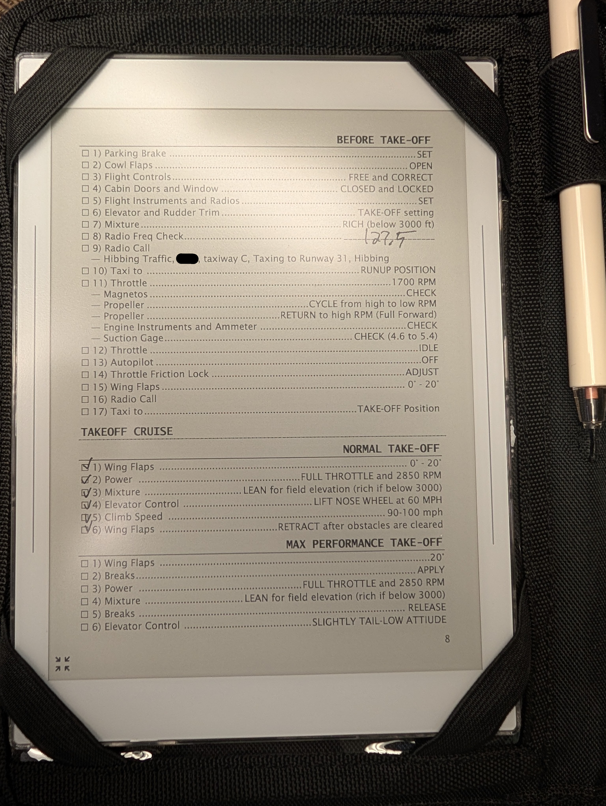
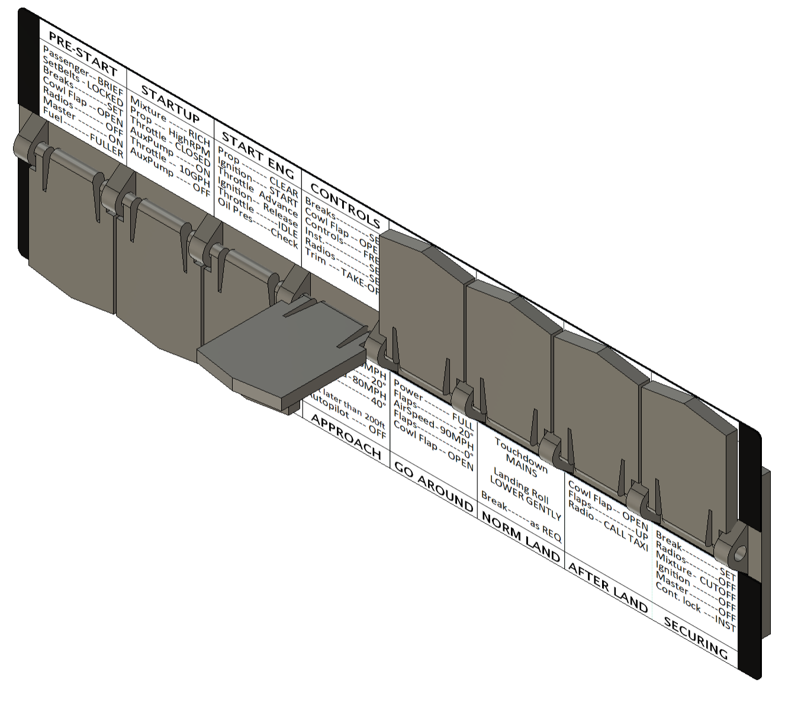
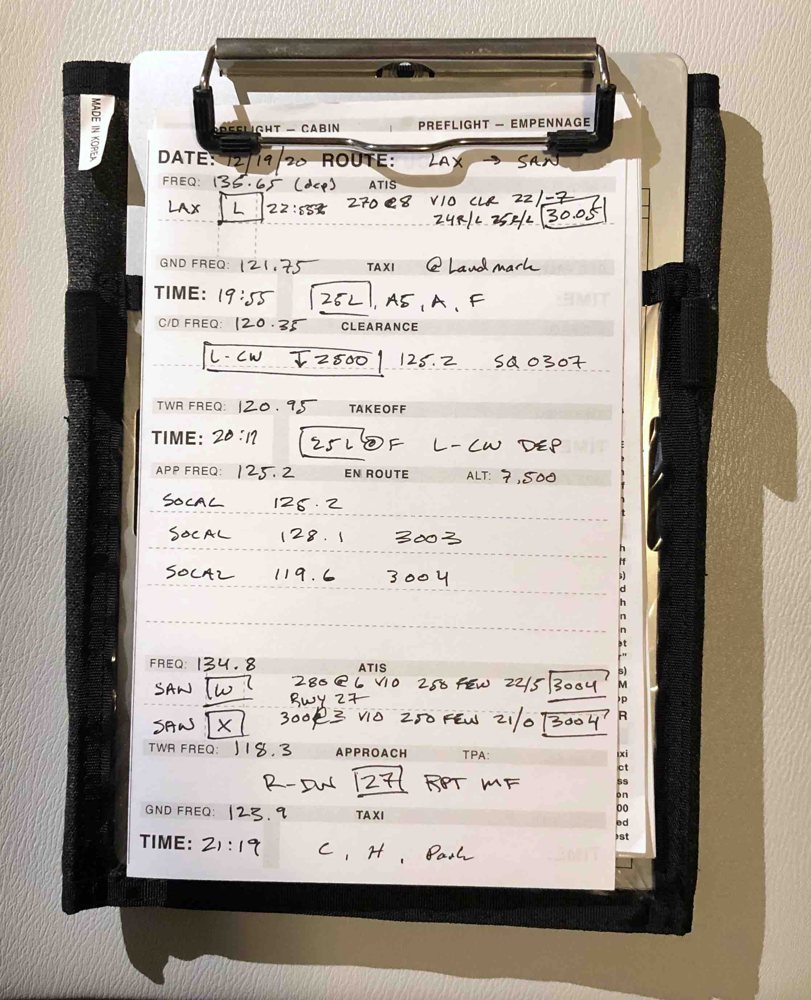

# Supernote Nomad
As it turns out the Supernote Nomad fights a common kneboard perfectly.  The writing on an eInk display is far and away superior to an ipad or other tablet.  You get the free form writing and tactile feel of paper note taking with the digital preservation and saving of a tablet.

## Cessna U206F Checklist
The Cessna U206F Supernote Nomad Checklists are based on the 1975 Cessna U206F "Owner's Manual" and the 1975 Floatplane owner's manual supplement.

# Flip-Tab Checklist
In the old days mechanical checklists used to exist for a pilot to flip through them and run their hand along to know the checklist was complete.  There is very little evidence that these used to exist, or I don't know the right name for them.  [Someone did a DIY of it some years back](https://www.youtube.com/watch?v=JcCw5mA0tO4), and we will do another one here, but make the files to recreate it freely available.

Making some slow progress on this.  Added some 3d printable files for the design as it currently is.  Probably 80% finished, still have to source aluminum etched plates.  Template for the checklist is roughed in as well.

# Kneeboard
A collection of aircraft checklists, templates, and documents -- used before, during, and after flight.

## Cessna C172M Checklist
The Cessna 172M checklist is based on the 1976 Cessna 172M "Skyhawk" Pilot Operating Manual (POH), has been honed over many sorties, and enriched with elements of [AQP](https://flightchops.com/grassroots/).

## In-Flight Notes Template
I prefer pencil and paper over an EFB touchscreen. The kneeboard-sized, note-taking template is designed to help organize important information for all phases of flight, and to compliment the checklist and EFB as a reminder of what's expected next. It can be used for both VFR and IFR flights.

Example of use -- VFR cross-country from LAX to SAN:

## macOS Print Settings and Folding Instructions
The PDFs are designed to print on standard 8" x 11" paper. The following are the ideal macOS print settings (Window should have similar options):
* Two-Sided: checked
* Black & White: checked
* Scale: 100%
* Quality: Best
* Layout: Two-Sided, Short-Edge binding

And here's how you fold them:

# Bugs

If you find an error, please let me know by submitting an issue.

# Contributions

Contributions are welcome!

# License
The artifacts in this repository are licensed under [CC BY-NC-SA 4.0](http://creativecommons.org/licenses/by-nc-sa/4.0/?ref=chooser-v1)
